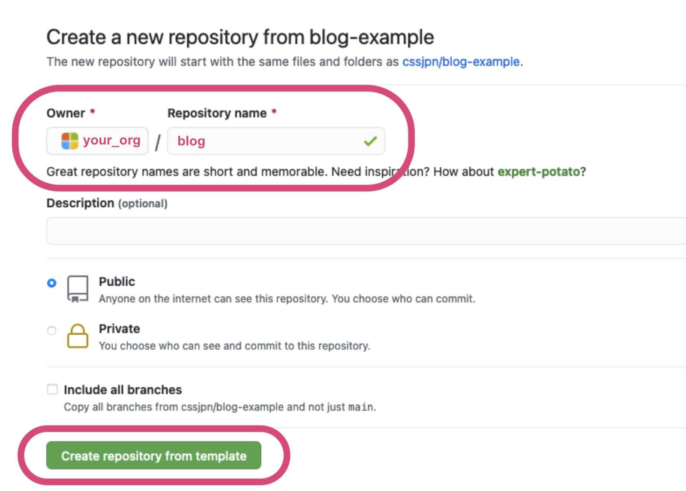

> NOTE: This document is cloned from [cssjpn/blog-example](https://github.com/cssjpn/blog-example/blob/main/docs/getting-started.md)

# Getting Started

This guide covers getting started with the `blog-example`.

## Installation

In this _Getting Started_, you need `git`, `docker` and `docker-compose`.

### Git

* Windows: Download & install [git](https://git-scm.com/download/win).
* Mac: Install it with [Homebrew](https://brew.sh/), [MacPorts](http://www.macports.org/) or [installer](http://sourceforge.net/projects/git-osx-installer/).
* Linux (Ubuntu): `sudo apt-get install git-core`

### Docker

* Windows / Mac
  * https://www.docker.com/products/docker-desktop
* Linux (Ubuntu)
  * `docker`: https://docs.docker.com/engine/install/ubuntu/
  * `docker-compose`: https://docs.docker.com/compose/install/

Make sure the following commands are successful:

```shell
$ git
$ docker
$ docker-compose
```

## Setup a new CSS Blog

### Creating a blog repository from a template

Navigate to the [cssjpn/blog-example](https://github.com/cssjpn/blog-example) page. Above the file list, click **Use this template**.


Select your organization from **Owner** menu, and type a name for your blog repository (ex. blog).
Click **Create repository from template**.



### Cloning a repository

```shell
# Move to your working directory
$ cd {YOUR_WORKING_DIR}

# Cloning a blog repository
$ git clone git@github.com:${YOUR_ORGANIZATION}/blog.git
$ cd blog
```

### Initialize blog theme

Blog theme (.css, .js, etc...) is configured as git submodule. This example is using [jpazureid/hexo-theme-jpazure](https://github.com/jpazureid/hexo-theme-jpazure)

```shell
# Initialize and Update themes
$ git submodule update -i
```

### Customize site configuration file

You can configure most settings here.

```shell
# edit config with your favorite editor
$ code _config.yml
$ vim _config.yml
...
```

## Writing blog articles

Now you can start writing articles!

```shell
# Create new branch
$ git checkout -b add_article

# Create or Edit articles with your favorite editor
$ vim articles/information/test.md
```

### Start / Stop local-preview server

Do you want to preview your article? You can start a local-preview server using following command. This is at `http://localhost:4000/`.

The server will reload files automatically if you make new changes. Please reload your browser.

```shell
# Run server
$ docker-compose up
 ...
blog_1  | INFO  Start processing
blog_1  | INFO  Hexo is running at http://localhost:4000 . Press Ctrl+C to stop.
```

To stop server, press `Ctrl+C` and `docker-compose down`.

```shell
# Stop server
^CGracefully stopping... (press Ctrl+C again to force)
Stopping example_blog_1 ... done

$ docker-compose down
```

## Publish Blog with GitHub Pages

In this tutorial, we use [GitHub Actions](https://docs.github.com/en/actions) to deploy [GitHub Pages](https://pages.github.com/).

The repository already has a workflow for GitHub Pages ([.github/workflows/upload-gh-pages.yml](https://github.com/cssjpn/blog-example/blob/main/.github/workflows/upload-gh-pages.yml)).

You can achieve publishing your blog easily with following steps.

### Commit your changes and Create Pull Request

```shell
# Commit changes
$ git add .
$ git commit -m 'Add article'
```

```shell
# Push 'add_article' branch to remote repository
$ git push origin add_article
  ...
remote: Resolving deltas: 100% (2/2), completed with 2 local objects.
remote:
remote: Create a pull request for 'add_article' on GitHub by visiting:
remote:      https://github.com/${ORG_NAME}/blog/pull/new/add_article
remote:
To github.com:${ORG_NAME}/blog.git
 * [new branch]      add_article -> add_article
```

You can open new Pull Request from `https://github.com/${ORG_NAME}/blog/pull/new/${BRANCH_NAME}`.

### Merge Pull Request

When new changes is merged to `main` branch, the workflow jobs will be triggered.
The jobs automatically builds blog pages and uploads generated files to `gh-pages` branch.

You can check workflow runs at `Actions` section on GitHub.
`https://github.com/{ORG_NAME}/blog/actions`

### Configure GitHub Pages

Once the workflow is finished, the generated pages can be found in the `gh-pages` branch of the repository.

To configure GitHub Pages, navigate **Settings** > **Pages** section. Select `gh-pages` branch as source and click **Save**.


Now you can access your blog! :tada:
`https://${ORG_NAME}.github.io/blog/`

It could be takes few minutes. If you got 404 page, please try to access later.

## Next steps

In this guide, you created a blog repository and then deployed site to GitHub Pages using GitHub Actions workflow.

For more information about GitHub Actions for CSS Blog, see the [cssjpn/blog-gh-actions](https://github.com/cssjpn/blog-gh-actions) End-to-End Sample Workflows.

* [Build blog and Publish to GitHub Pages](https://github.com/cssjpn/blog-gh-actions/blob/main/docs/upload-gh-pages.md)
* [Deploy preview site for Pull Requests](https://github.com/cssjpn/blog-gh-actions/blob/main/docs/deploy-preview.md)
